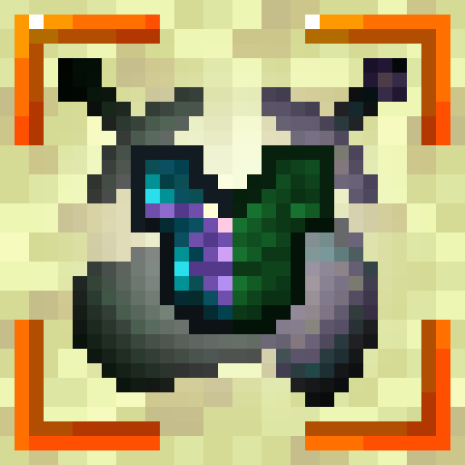
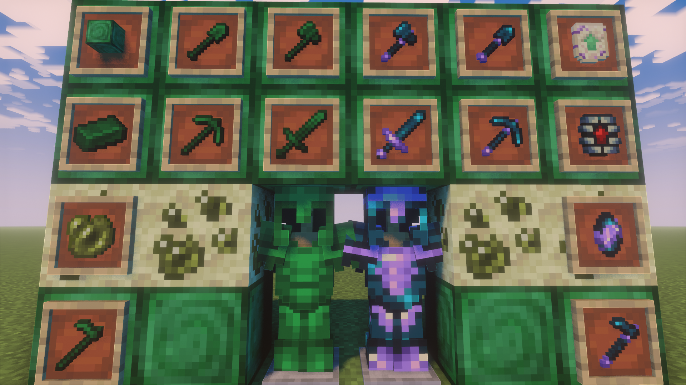

  
  <h1 align="center">Pearlanium Mod</h1> 
  
  

    
    
    
    
    
  

  

Pearlanium Mod introduces two new material tiers that extend Minecraft's progression system in a way that feels natural to the vanilla experience. The mod adds Pearlanium (a superior Netherite variant) and Wardium (an advanced alloy tier), along with new tools, armor, blocks, and ore generation.

This mod is built around the absolute theory of Minecraft — every item, mechanic, and material follows internally consistent logic rooted in Minecraft's existing systems. Nothing is added "just because"; everything has a purpose and a place in the game's ecosystem.

---

## 📜 Lore

### 🌀 Pearlanium — The Essence of the End

In The End, where Endermen exist in vast numbers, lies a rare mineral formation. When Endermen die in The End, their pearls and accumulated experience don't just vanish, they crystallize over time, getting covered and compressed by end stone particles that permeate that dimension overtime. These compressed clusters of pearls, combined with XP, forms Brute Pearlanium.

There was a time during the transition of men to enderman where the civilization still had knowledge of The Nether's crafting arts, applying it to the new material they were accidentally forming, creating the first pearlanium smithing template, that was then stored in end chests.

This material has a special property, the same as ender pearls, although corrupted over time. Ender teletransporting works via setting a defined point in space for teleportation by quantically entangling two points in space, swapping them. Pearlanium, due to being compressed by end stone and merged with experience has a corrupted setter, which makes everything in a certain radius around it be entangled, ready for a teleportation it can never achieve. Since everything is already entangled, you can't entangle it to something else, meaning teleportation doesn't work properly around it, rendering endermen teleport-less. This is called "Quantum Entanglement Interference".

"Note: Do be careful with Endermen that cannot teleport, as they are still crazy fast and can deflect arrows easily, you could get a wound real easy. -K"

### 👾 Wardium — The Living Alloy

Since Pearlanium contains a certain concentration of experience, it'd be possible to alloy the essence of Sculk to it, but we can't just use a simple echo shard, or it'll go quickly out of control and consume the whole material (And what's forging it) during the smithing process. So what we do is surpass our ancestors and get a core of a sculk being, the Warden's heart. But of course, we'd still run into the same issue again, although in theory you could forge a absolutely pure material with echo shards and the Warden's heart, when you kill a mob for the first time, the material will absorb the experience and start growing into you, quickly killing you and consuming your experience, transforming you into a new Warden. To stop that, we use the same thing we use to calibrate sculk in general, amethysts. Echo shards are a crystalization of sculk, caused by pressure exerted by the cave system they usually reside in. Compressing them even further with amethysts results in a small, calibrated echo shard.

Using it and the Warden's heart as a base, you can force the calibrated echo shard to merge with Pearlanium through brute force (Hammering it), which will make the echo shard, which in normal circumstances wouldn't spread anymore to spread one last time by blunt trauma; Causing the material to alloy with surrounding traces of pearlanium, netherite and diamond remnants. This creates **Wardium** — a hyper-resistant material where the experience has been absorbed by the sculk and made it bond with the metal at a molecular level.

Wardium's unique property, as well as keeping the "Quantum Entanglement Interference" from Pearlanium is that sculk is extremely sensitive to vibration, so sensitive in fact, that it absorbs vibrations as much as possible, using it as a source of alternative energy to keep the sculk alive, as it cannot feast on experience anymore. This causes the wearer to be extremely silent, rendering them virtually immune to Sculk Sensors or the Warden's tendrils.

Creating a tool or armor made out of Wardium is to honor your ancestors, finally surpassing them and avenging the ones killed by wardens.
---

## 🖥️ Installation

### Requirements

- **Minecraft**: Version 1.21.1
- **Java**: Version 21

#### Fabric / Quilt
- **Fabric Loader**: 0.16.10 or higher
- **Quilt Loader**: 0.30.0-beta.0 or higher
- **Fabric API**: Required for mod functionality

#### NeoForge (Via Sinytra Connector)
- **Sinytra Connector**: 2.0.0
- **Forgified Fabric API**: 0.116.7+1.21.1

### Steps

#### Fabric / Quilt
1. Install [Fabric Loader](https://fabricmc.net/) or [Quilt Loader](https://quiltmc.org/) for Minecraft 1.21.1
2. Download and install [Fabric API](https://modrinth.com/mod/fabric-api)
3. Download the latest **Pearlanium Mod** release from [Modrinth](https://modrinth.com/mod/pearlanium-mod) or [CurseForge](https://www.curseforge.com/minecraft/mods/pearlanium-mod)
4. Place the mod JAR file in your `mods` folder
5. Launch the game with Fabric/Quilt profile

#### NeoForge
1. Install [NeoForge](https://neoforged.net/) for Minecraft 1.21.1
2. Download and install [Sinytra Connector](https://modrinth.com/mod/sinytra-connector)
3. Download and install [Forgified Fabric API](https://modrinth.com/mod/forgified-fabric-api)
4. Download the latest **Pearlanium Mod** release
5. Place the mod JAR file in your `mods` folder
6. Launch the game with NeoForge profile

---

## 🤝 Contributing

This project is open source! If you'd like to contribute:

1. Fork the repository
2. Create a feature branch
3. Submit a pull request

For major changes, please open an issue first to discuss what you would like to change.

---

## ⚖️ Licensing

This project is licensed under a dual license system:

- **Source Code:** Licensed under [GNU GPLv3](LICENSE). You are free to read, learn from, and modify the code, provided you keep it open source.
- **Assets (Textures/Models):** [All Rights Reserved](LICENSE_ASSETS.md). You may not reuse or redistribute the art assets without permission.

*Note: Content creators are free to monetize videos and streams featuring this mod.*

---

## 🙏 Credits

- **Developer**: [kawwabi](https://github.com/Kawwabi)
- **Repository**: [pearlanium-mod](https://github.com/Kawwabi/pearlanium-mod)

*Thank you for playing!*
